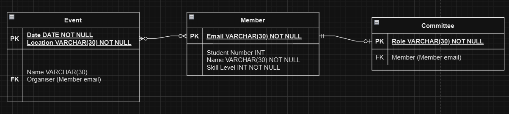

##  A TA's Guide to Software Tools (well kinda)
(last updated 30/01/25)

So, you reckon you can be a TA for Software Tools, eh? ~~well think again!~~

This is just a little guide to get you going from week to week, mostly because I got bored. This should remain accruate for as long as Joseph doesn't get bored of the lab sessions.

A lot of this is probably pretty basic, but seems to be sticking points for the new cohorts. It should contain answers to _most_ exercises and spots where a lot of students tend to go wrong.

### Week 1 - System Administration

A big thing for this week is that a lot of students don't really _get_ how the shell or ssh works. So before you try and fix anything, make sure to check whether they are in their personal machine, a lab machine `it######.wks.bris.ac.uk` or the bastion host `seis.bris.ac.uk`. 

#### Secure Shell

If someone is using Windows CMD to connect to the lab machines, they should probably use WSL, as the ssh -J command only works there. 

A common issue is that students won't change the USERNAME section of the ssh command. Make it clear to them that _most of the time_ something in CAPITALS needs to be replaced by the corresponding piece of information.

Command to make new ssh keyset (always handy to have): `ssh-keygen -t ed25519`

To check if keys already exist, make sure to check the `.ssh` folder.

If the student has decided _for some reason_ to rename their key file name, be aware that ssh may struggle to find the right file. This can cause issues.

#### Installing vagrant and Debian

First check, is the person using Mac? Then you need to ~~burn them~~ politely tell them they need to use the lab machines.

For some reason, students sometimes don't read the instructions. This results in their Vagrantfile being incorrect. If they're having issues running `vagrant up`, here are some common causes:
 - They somehow downloaded the wrong Vagrantfile (e.g. they made their own). **Fix**: copy the Vagrantfile from the GitHub into their version
 - Their Vagrantfile is being read as a txt file (this can happen if they download it directly from GitHub). **Fix**: run `mv Vagrantfile.txt Vagrantfile`.

Another common issue is with the VirtualBox versions. The most up to date version of VirtualBox is not supported by Vagrant, and so they need to download v7.0 or earlier. 

Note: as far as I'm aware, vagrant does not work in WSL

#### Debian system administration

Some students may get confused when adding package installation instructions in the lab machine Vagrantfile, just make sure that it is below the line: `echo "Post-provision installs go here"`

### Week 2 - Fundamentals

#### Shell Expansion

**Pattern matching solution:**
 - `cd empty; ../arguments *`
 - `./arguments '*'`
 - `./arguments $'*\a'`

#### File Permissions

We don't tend to get too many issues from this lab, the main thing is just to make sure that they know what user they're signed in as when running certain commands.

#### Shell Scripting

**Compile Helper Exercise solution:**

```
#! /bin/sh
echo $1
if [$1 = "compile"]
then 
    if [$2 != *.c*]
    then
        gcc -Wall -std=c11 -g ${2}.c -o $2
    else
        export STRING=$2 | sed 's/.$//' | sed 's/.$//'
        gcc -Wall -std=c11 -g $2 -o $STRING
    fi
else
    if [$1 = "run"]
    then
        if [$2 = *.c*]
        then
            export STRING=$2 | sed 's/.$//' | sed 's/.$//'
            ./$STRING
        else
            ./$2
        fi
    else
        if [$1 = "build"]
        then
            gcc -Wall -std=c11 -g ${2}.c -o $2
            ./$2
        else
            echo "This command isn't recognised by this program"
        fi
    fi
fi
```

#### Pipes

**Word list exercise solutions:**

 - First word in the file: `head -n 1 words`
 - Last word in the file: `tail -n 1 words`
 - Number of words in the file: `wc -l words`
 - 6171st word in the file: `head -n 6171 words | tail -n 1`
 - First 5 words that are among the last 100 words on the list: `tail -n 100 words | head -n 5`
 - Last 10 words in the file, sorted in reverse: `tail -n 10 words | sort -r`

### Week 3 - Regex

#### Regex

**Grep solutions:**
 - All words containing the letter Q, capitalised: `grep 'Q' words`
 - All words starting with the letter R, in either upper or lower case: `grep -i '^R' words`
 - All words ending in j: `grep 'j$' words`
 - The number of words containing the letter Q, ignoring case: `grep -i 'Q' words | wc -l`
 - The first 5 words containing the sequence "kp" but not "ckp": `grep -i 'kp' words | grep -v 'c'`
 - The last 15 words of exactly 2 letters: `grep '^..$' words | tail -n 15`
 - All 3 letter words with no vowels: `grep '^...$' words | grep -iv '[aeiou]'`
 - All words of exactly 7 letters, where the 3rd one is an e and the word ends in '-ded': `grep '^..e.ded$' words`
 - All words that start with P (not case sensitive), and contain at least 4 instances of a: `grep -i '^P.*a.*a.*a.*a.*' words`

**Sed solutions:**
 - Find all words which end in 'ay', change 'day' into 'week': `grep 'ay$' words | sed 's/day/week/'`
 - Replace all words from the selection above which begin with 's' with the word 'sway': `grep -i 'ay$' words | sed 's/^s\(.*\)/sway/I'` (I makes the sed command case insensitive)
 - Separate the word and the 'day': `grep 'ay$' words | sed 's/day$/& day/'`
 - Replace day with 'X day or X week': `grep -i 'ay$' words | sed 's/day$/\1 day or \1 week/'`
 - Flip the word and parenthesised: `grep -e day$ -e way$ words | sed 's/\(.*\)\(day\|way\)$/\2(\1)/'`

### Week 4 & 5 - Git

#### Git

Make sure the students actually change the IdentityFile line in `~/.ssh/config`

If they're struggling with checking out to main, it may be that their default branch is master.

**MAKE SURE THAT THEY CLONE PRIVATE REPOS WITH SSH:** otherwise they won't be able to edit, as password verification was depricated. To check this you can run `git remote show origin`, ssh will have the structure `git@github.com:USERNAME/REPONAME`.

There are 2 labs for Git, and people seem to forget how they added the keys in the first lab. So if they're having access issues, it's probably because they set up the keys for their local machine, and not the VM.

### Week 6 - Build Tools

This is about the time in the term where the questions calm down ~~thank God~~. 

Just pay attention to which commands are actually _meant_ to be ran, as some are just examples and cause some confusion.

#### Python

Pip causes some issues for people, make sure it is installed before trying to install mistletoe, because otherwise it obviously won't work! (The _amount of times_ I had to fix this this year)

`pip list` is useful to see what python modules are installed

If the students put the python code in a file, it WILL NOT print the markdown result to command line unless they add the print statement themselves.

#### Java

Make sure the students actually set their JAVA_HOME and PATH variables. This can sometimes cause issues if the jdk has a slightly different name.

When adding Thymeleaf as a dependency (or really anything else) make sure you add it to the pom.xml under the general dependencies section, not dependencyManagement.

### Week 7 - Debugging (aka Jo's Birthday Lab)

Now this lab is _something_. Be prepared for people to not know how to use GDB, or how to read assembly. Yahoo!

It is recommended that the students don't look directly at the source file or `solutions.h` (obviously)

#### General solutions

These can also be found in `cheater.sh` on the GitHub

1: `Beetlejuice`
2: `Betelgeuse`
3: `MeSayDay0h`
4: `12345`
5: `z+dddddd++>z+dd+dd+++++d+>c>c<+++++++d>>c>c>c>c>c>c<<<<<<>-------------d>cl----->>++++++++d->---------d->`

#### Crack me 1

Run `ltrace ./crackme-1 <<<';*3$'`, which will return a list of library calls. The notable one is `strcmp(";*3$", "Beetlejuice")` as it's comparing our input with the solution.

#### Crack me 2

Begin debugging the code with `gdb ./crackme-2`

Set a break point at main: `b main`. Then run.

Disassemble the function: `disas`

Here's where the trickier bit comes in. We want to look at the values being held in the accumulator, as `cmp` (like crackme-1) is the key here.

There are 10 occurences where a value is compared to `%al`, which stores the last 8 bits of the value in the accumulator. We want these values, as they can be translated into ASCII to form a string.

Now, the order in which the characters are checked isn't numerical, but we can check which value is being checked by looking at 2 lines before... the index of the character is the value being added to `%rax`. 

#### Crack me 3

(The hint in the source code is in a caesar cipher with shift 13. We learn that the input values are XORed with 0x42 before being compared)

Here, by running `ltrace`, we know that the string doesn't get directly compared.

We can see in the disassembled code that the value of `%edx` is being XORed with 0x42 before being compared.

We also see that the value of rax (which we can see with i r, holds the length of the string) is compared with `0xa`, which translates to 10, so we know the password is 10 characters long.

### Week 8 & 9 - SQL

We have made it to SQL! Yayy

#### Reading an ER diagram

 - Which relationships are mandatory or optional? 
 - - Any relation with a 'circle' on the connection can have a zero value, and hence be optional
 - Which relationships are one-one, one-many, many-many?
 - - one-many: RGroup + Lecturer, Lecturer + Unit
 - - many-many: Student + Unit 
 - How do the above affect the placement of foreign keys? For example, why is the foreign key for 'lecturer beling to research group' on the Lecturer table?
 - - Optional relations mean that foreign key placement can be tricky. You should have foreign keys where you know the entity has to exist

 #### Making an ER diagram

 

 #### Implementing a Schema

 ```
 CREATE TABLE IF NOT EXISTS Event (
    Date DATE NOT NULL, 
    Location VARCHAR(20) NOT NULL, 
    Name VARCHAR(20), 
    FORGEIGN KEY (Organiser) REFERENCES Members(Email), 
    PRIMARY KEY (Date, Location)
 );

CREATE TABLE IF NOT EXISTS Member(
    Email VARCHAR(30) NOT NULL PRIMARY KEY, 
    StudentNumber INTEGER, 
    Name VARCHAR(30) NOT NULL, 
    SkillLevel INTEGER NOT NULL
);

CREATE TABLE IF NOT EXISTS Committee(
    Role VARCHAR(30) NOT NULL PRIMARY KEY, 
    FOREIGN KEY (Member) REFERENCES Members(Email)
);
```

#### Easier questions

##### Elections

 - List the names of all parties that stood in the election, ordered alphabetically by name.
 ```
 SELECT Party.name FROM Party
 ORDER BY Party.name
 ```

 - List the names of all parties that stood in the Bedminster ward.
 ```
 SELECT Party.name FROM Candidate
 INNER JOIN Party on Candidate.party = Party.id
 INNER JOIN Ward on Candidate.ward = Ward.id 
 WHERE Ward.name = 'Bedminster'
 ```

 - How many votes did Labour get in the Stockwood ward?
 ``` 
 SELECT Votes FROM Candidate
 INNER JOIN Party ON Candidate.party = Party.id
 INNER JOIN Ward on Candidate.ward = Ward.id 
 WHERE Party.name = 'Labour' AND Ward.name = 'Stockwood'
 ```

 - List the names, parties and number of votes obtained for all candidates in the Southville ward. Order the candidates by number of votes obtained descending (winner comes first).
```
SELECT Candidate.name, Party.name, Candidate.votes FROM Candidate
JOIN Party ON Candidate.party = Party.id
JOIN Ward ON Candidate.ward = Ward.id
WHERE Ward.name = 'Southville'
ORDER BY Votes DESC
```

 - List the name, party and number of votes obtained for the winner only in the Knowle ward.
 ```
SELECT Candidate.name, Party.name, Candidate.votes FROM Candidate
JOIN Party ON Candidate.party = Party.id
JOIN Ward ON Candidate.ward = Ward.id
WHERE Ward.name = 'Knowle'
ORDER BY Votes DESC
LIMIT 1
```

##### Census 
 - The university of Bristol is situated in the Cabot ward (ward names are not always distinct, but this one is). Find the names and codes of the CLU, region and country containing the Cabot ward (CLU = county level unit = "row in County table").

```
SELECT County.name, County.code, Region.name, Country.name
FROM County 
INNER JOIN Country ON County.Country = Country.code
INNER JOIN Region ON County.parent = Region.code
INNER JOIN Ward ON County.code = Ward.parent
WHERE Ward.name = 'Cabot'
```

 - Find the number of women managers in the Cabot ward.
 ```
 SELECT Data
 FROM Statistic
 WHERE Statistic.occId = 1 AND gender = 1 AND wardId = 'E05001979'
 ```
 - For the Stoke Bishop ward, list the 9 occupation class names and the number of men in each occupation. Your table should have two columns called name and number.
```
SELECT Occupation.name AS name, Statistic.data AS number
FROM Statistic 
JOIN Occupation ON Statistic.occId = Occupation.id
WHERE Statistic.gender = 0 AND wardId = 'E05002003'
```

#### Harder Questions

##### Elections
 - How many votes were cast in all of Bristol in the 2014 elections?
 ```
 SELECT SUM(Votes) FROM Candidate
 ```

 - How many votes were cast in the 'Windmill Hill' ward and what percentage of the electorate in this ward does this represent? Your statement should produce a table with one row and two columns called 'votes' and 'percentage'.
 ```
 SELECT SUM(Votes) AS votes, SUM(votes)/electorate * 100 AS percentage
 FROM Candidate
 JOIN Ward on Candidate.ward = Ward.id
 WHERE Ward.name = "Windmill Hill"
 ```
 - List the names, parties and percentage of votes obtained for all candidates in the Southville ward. Order the candidates by percentage of votes obtained descending.
 ```
 SELECT Candidate.name AS name, 
 Party.name As Party, 
 votes/(SELECT SUM(votes) 
    FROM Candidate 
    JOIN Ward ON Candidate.ward = Ward.id 
    WHERE Ward.name = "Southville") 
    * 100 AS percentage FROM Candidate
 JOIN Ward ON Candidate.ward = Ward.id 
 JOIN Party ON Candidate.party = Party.id
 WHERE Ward.name = "Southville"
 ORDER BY votes DESC
 ```

 - How successful (in % of votes cast) was the Conservative party in each ward?
 ```
 SELECT Ward.name AS ward, 
 votes/(
    SELECT SUM(votes)
    FROM Candidate
    WHERE ward = Ward.id
 )
 * 100 AS percentage
 FROM Candidate
 JOIN Ward ON Candidate.ward = Ward.id
 JOIN Party ON Candidate.party = Party.id
 WHERE Party.name = "Conservative"
 ```

 - Which rank did Labour end up in the 'Whitchurch Park' ward? Your statement should produce a table with a single row and column containing the answer as a number. You can assume no ties.
 ```
 WITH r AS (
    SELECT RANK() OVER (ORDER BY votes DESC) AS Rank, 
    Party.name as P 
    FROM Candidate
    JOIN Party ON Candidate.party = Party.id
    JOIN Ward ON Candidate.ward = Ward.id
    AND Ward.name = "Whitchurch Park")
 SELECT r.Rank
 FROM r
 WHERE r.p = "Labour"
 ```

 - What is the total number of votes that each party got in the elections? Your result should be a table with two columns party, votes.
```
SELECT Party.name AS party, SUM(votes) AS votes
FROM Candidate
JOIN Party ON Party.id = Candidate.Party
GROUP BY Party.name
```

 - Find all wards where the Green party beat Labour and create a table with two columns ward, difference where the difference column is the number of Green votes minus the number of Labour votes. Your table should be ordered by difference, with the highest one first.
 ```
 WITH Labour AS (
    SELECT Candidate.votes AS votes, Ward.name AS name
    FROM Candidate
    JOIN Party ON Candidate.party = Party.id
    JOIN Ward ON Candidate.ward = Ward.id
    WHERE Party.name = "Labour"
 ), 
 Green AS (
    SELECT Candidate.votes AS votes, Ward.name AS name
    FROM Candidate 
    JOIN Party ON Candidate.party = Party.id 
    JOIN Ward ON Candidate.ward = Ward.id
    WHERE Party.name = "Green
 )
 SELECT Ward.name AS ward, 
 (Green.votes - Labour.votes) AS difference 
 FROM Ward
 JOIN Green ON Green.name = Ward.name
 JOIN Labour ON Labour.name = Ward.name
 WHERE Green.votes > Labour.votes
 ORDER BY difference DESC
 ```

##### Census

 - How many women work in sales and customer service occupations and live in the Cabot ward of Bristol?
 ```
 SELECT Statistic.data
 FROM Statistic
 JOIN Occupation ON Statistic.occId = Occupation.id
 WHERE wardId = "E05001979" AND gender = 1 AND Occupation.name = "sales and customer service occupations"
 ```

 - How many people work in sales and customer service occupations and live in the Cabot ward of Bristol?
 ```
 SELECT SUM(Statistic.data)
 FROM Statistic 
 JOIN Occupation ON Statistic.occId = Occupation.Id
 WHERE wardId = "E05001979" AND Occupation.name = "sales and customer service operations"
 ```

 - How many people work in caring, leisure and other service occupations in all of the City of Bristol CLU?
 ```
 SELECT SUM(Statistic.data)
 FROM Statistic
 JOIN Ward ON Statistic.wardId = Ward.code
 WHERE occId = 6 AND Ward.parent = "E06000023"
 ```

 - In the Cabot ward, produce a table listing the names of the 9 occupation classes and the number of people in each of the classes in this ward.
 ```
 SELECT Occupation.name AS occupation, 
 SUM(Statistic.data) AS total
 FROM Statistic
 JOIN Occupation ON Statistic.occId = Occupation.id
 WHERE Statistic.wardId = "E05001979"
 GROUP BY Occupation.name
 ```

 - Find the working population, ward name and CLU name for the smallest ward (by working population) in the 2011 census.
 ```
 SELECT Ward.name AS ward, 
 SUM(Statistic.data) AS workingPop, 
 County.name AS CLU, 
 FROM Statistic
 JOIN Ward ON Statistic.wardId = Ward.code
 JOIN County ON Ward.parent = County.code 
 GROUP BY Ward.name
 ORDER BY SUM(Statistic.data) ASC
 LIMIT 1
 ```

 - The same as the last question, but now produce a table with two rows, one for the smallest and one for the largest ward. There's no quicker way than repeating the last query twice, the question is how to stick the two "copies" together.
 ```
 (SELECT Ward.name AS ward, 
 SUM(Statistic.data) AS workingPop, 
 County.name AS CLU
 FROM Statistic 
 JOIN Ward ON Statistic.wardId = Ward.code
 JOIN County ON Ward.parent = County.code
 GROUP BY Statistic.wardId
 ORDER BY SUM(Statistic.data) ASC
 LIMIT 1
 )
 UNION
 (SELECT Ward.name AS ward, 
 SUM(Statistic.data) AS workingPop, 
 County.name AS CLU
 FROM Statistic
 JOIN Ward ON Statistic.wardId = Ward.code 
 JOIN County ON Ward.parent = County.code
 GROUP BY Statistic.wardId
 ORDER BY SUM(Statistic.data) DESC 
 LIMIT 1
 )
 ```

 - Find the average size of a ward's working population in the London region.
 ```
 SELECT AVG(Statistic.data) AS average
 FROM Statistic
 JOIN Ward ON Statistic.wardId = Ward.code
 JOIN County ON Ward.parent = County.code
 JOIN Region ON County.parent = Region.code
 WHERE Region.code = "E12000007"
 ```

 - The same as the last question but now for every region—your query should produce a table with one row per region.
 ```
 SELECT AVG(Statistic.data) AS average, 
 Region.name AS Region 
 FROM Statistic
 JOIN Ward ON Statistic.wardId = Ward.code
 JOIN County ON Ward.parent = County.code
 JOIN Region ON County.parent = Region.code
 GROUP BY Region.code
 ```

 ### Week 10 Datalog 

 Random issues from this week:
 - The AbcDatalog interpreter doesn't support the OR operator syntax, so if you want to make an OR rule, you need to define 2 rules with the same name and paramters with the different components of the rule. 
 - The parameters of the datalog rules must be:
 - - lower case
 - - no strings

### Part 2
### Week 11 - HTTP

This week's lab involves running a basic client-server system across 2 terminals

#### Exploring HTTP

A source of issues may be due to vagrant, as you need to make sure that the student has the line:

```
config.vm.network "forwarded_port", guest: 8000, host: 8000
```

in their Vagrantfile.

Note that running wget on the `http-response` gives the wrong content. It results in the html version of the github page, NOT the contents of the file.

#### Research Exercises

 - The fragment part of a URL is an internal page reference which refers to a section within a web page. It usually appears at the end of a URL and begins with a #
 - The Accept header in HTTP defines the media types that the client can accept from the server
 - A User-Agent is a software agent used for retrieving web content and facilitating end-user interaction. 
 - Spaces in a URL are replaces with '%20' or '+'. Other characters which need encoding are: ':', '/', '?', '#', '[', ']', '@', '!'
 - The University website uses Apache for their server

#### A server in Java

This section goes through the basic structure of a spring boot API

To do the exercise for this section, you need the following code in Controller.java:

```
 @GetMapping("/bad")
    public ResponseEntity<String> badPage() {
        HttpHeaders headers = new HttpHeaders();
        headers.set(HttpHeaders.CONTENT_TYPE, "text/plain");

        return new ResponseEntity<String>("Bad request, try again", headers, 404);
    }
```

### Week 12 - html

#### Basic html5

```
<!DOCTYPE html>
<html lang="en">
    <head>
        <meta charset="utf-8" />
        <title>COMS10012 Software Tools</title>
    </head>
    <body>
        <h1>COMS10012 Software Tools</h1>
        <p>
            <strong>This unit teaches you the basics of web development.</strong>
        </p>
        <h2>Content</h2>
        <p>
            Content is a combination of video lectures and reading assignments from the <em>Mozilla Developer Network</em>.
        </p>
        <p>
            You can find the unit page <a href="cs-uob.github.io/COMS10012">on github</a>.
        </p>
        <h2>Learning Outcomes</h2>
        <p>
            After completing this unit, you will be able to use the following:
        </p>
        <ul>
            <li>HTML5</li>
            <li>CSS</li>
            <li>JavaScript</li>
        </ul>
    </body>
</html>
```

#### Templating

Basic exercise:
```
<!DOCTYPE html>
<html lang="en">
    <head>
        <meta charset="utf-8" />
        <title>List of Units</title>
    </head>
    <body>
        <h1>Table of units</h1>
        <table>
            <tr>
                <th>Code</th>
                <th>Unit title</th>
                <th>Link</th>
            </tr>
            <tr th:each="unit : ${units}">
                <td th:text="${unit.code}"></td>
                <td th:text="${unit.title}"></td>
                <td th:href="'/unit/' + ${unit.code}" th:text="details"></td>
            </tr>
        </table>
    </body>
</html>
```

Intermediate Exercise 1: 

Make sure that the updated version of Controller.java imports the Student model file

In Controller.java, add:
```
@GetMapping("/students")
    public String studentsPage() {
        Database d = new DatabaseImpl();
        List<Student> students = d.getStudents();
        Context cx = new Context();
        cx.setVariable("students", students);
        return templates.render("students.html", cx);
    }

    @GetMapping("/students/{id}")
    public ResponseEntity<String> 
    StudentDetailPage(@PathVariable String id) {
        Database d = new DatabaseImpl();
        Student u = null;
        int idInteger = Integer.parseInt(id);
        for (Student uu : d.getStudents()) {
            if (uu.getId() == idInteger) {
                u = uu;
                break;
            }
        }
        
        if (u == null) {
            return ResponseEntity
                .status(404)
                .header(HttpHeaders.CONTENT_TYPE, "text/plain")
                .body("No student with id " + id);
        }
        
        Context cx = new Context();
        cx.setVariable("student", u);
        return ResponseEntity
            .status(200)
            .header(HttpHeaders.CONTENT_TYPE, "text/html")
            .body(templates.render("student.html", cx));
    }
```

students.html should be created in the templates folder:
```
<!DOCTYPE html>
<html lang="en">
    <head>
        <meta charset="utf-8" />
        <title>List of Students</title>
    </head>
    <body>
        <h1>Table of students</h1>
        <table>
            <tr>
                <th>ID</th>
                <th>Student Name</th>
            </tr>
            <tr th:each="student : ${students}">
                <td th:text="${student.id}"></td>
                <td th:text="${student.name}"></td>
            </tr>
        </table>
    </body>
</html>
```

student.html should also be created in the templates folder:
```
<!DOCTYPE html>
<html lang="en">
    <head>
        <meta charset="utf-8" />
        <title>Student details</title>
    </head>
    <body>
        <h1>Student details</h1>
        <p><strong>Student name:</strong> <span th:text="${student.name}"></span></p>
        <p><strong>Student id:</strong> <span th:text="${student.id}"></span></p>
    </body>
</html>
```

Intermediate Exercise 2: 

student.html:
```
<!DOCTYPE html>
<html lang="en">
    <head>
        <meta charset="utf-8" />
        <title>Student details</title>
    </head>
    <body>
        <h1>Student details</h1>
        <p><strong>Student name:</strong> <span th:text="${student.name}"></span></p>
        <p><strong>Student id:</strong> <span th:text="${student.id}"></span></p>

        <h1>Table of units</h1>
        <table>
            <tr>
                <th>Code</th>
                <th>Unit title</th>
                <th>Grade</th>
            </tr>
            <tr th:each="result : ${results}">
                <td th:text="${result.getFirst().code}"></td>
                <td th:text="${result.getFirst().title}"></td>
                <td th:text="${result.getSecond()}"></td>
            </tr>
        </table>
    </body>
</html>
```

change Controller.java to return the results in the Context object:
```
@GetMapping("/students/{id}")
    public ResponseEntity<String> 
    StudentDetailPage(@PathVariable String id) {
        Database d = new DatabaseImpl();
        Student u = null;
        List<Pair<Unit, Integer>> results = null;
        int idInteger = Integer.parseInt(id);
        for (Student uu : d.getStudents()) {
            if (uu.getId() == idInteger) {
                u = uu;
                results = u.getGrades();
                break;
            }
        }
        
        if (u == null) {
            return ResponseEntity
                .status(404)
                .header(HttpHeaders.CONTENT_TYPE, "text/plain")
                .body("No student with id " + id);
        }


        Context cx = new Context();
        cx.setVariable("student", u);
        cx.setVariable("results", results);
        return ResponseEntity
            .status(200)
            .header(HttpHeaders.CONTENT_TYPE, "text/html")
            .body(templates.render("student.html", cx));
    }
```

### Week 13 & 14 - CSS

#### Styling Text

To fit the baseline image background, reset.css:

```
/* http://meyerweb.com/eric/tools/css/reset/ 
   v2.0 | 20110126
   License: none (public domain)
*/

html, body, div, span, applet, object, iframe,
h1, h2, h3, h4, h5, h6, p, blockquote, pre,
a, abbr, acronym, address, big, cite, code,
del, dfn, em, img, ins, kbd, q, s, samp,
small, strike, strong, sub, sup, tt, var,
b, u, i, center,
dl, dt, dd, ol, ul, li,
fieldset, form, label, legend,
table, caption, tbody, tfoot, thead, tr, th, td,
article, aside, canvas, details, embed, 
figure, figcaption, footer, header, hgroup, 
menu, nav, output, ruby, section, summary,
time, mark, audio, video {
	margin: 0;
	padding: 0;
	border: 0;
	font-size: 100%;
	font: inherit;
	vertical-align: baseline;
}
/* HTML5 display-role reset for older browsers */
article, aside, details, figcaption, figure, 
footer, header, hgroup, menu, nav, section {
	display: block;
	font-weight: bold;
	font-size: 1.5rem;
}
body {
	line-height: 1;
}
ol, ul {
	list-style: none;
}
blockquote, q {
	quotes: none;
}
blockquote:before, blockquote:after,
q:before, q:after {
	content: '';
	content: none;
}
table {
	border-collapse: collapse;
	border-spacing: 0;
}
h1{
    font-weight: bold;
	font-size: 1.5rem;
	padding-top: 10px;
	padding-bottom: 10px;
    max-width: 40em;
    background-color: rgba(0, 0, 255, 0.25);
    font-family: "Calibri";
}
h2{
    font-weight: bold;
	font-size: 1.5rem;
	margin: 0 auto;
    max-width: 40em;
    padding-top: 10px;
    padding-bottom: 10px;
    background-color: rgba(0, 0, 255, 0.25);
    font-family: "Calibri";
}
body {
    background-image: url("baseline.png");
    line-height: 125%;
    margin: 0 auto;
    max-width: 40em;
    font-family: "Calibri";
}
ul {
    padding-left: 2em; /* the bullets appear in the padding */
    list-style-type: disc;
    list-style-position: outside;
}

```

#### Using a CSS Framework

Page2.html endstate:

```
<!DOCTYPE html>
<html lang="en">
    <head>
        <meta charset="utf-8" />
        <title>CSS example</title>
        <meta name="viewport" content="width=device-width, initial-scale=1">
        <link rel="stylesheet" href="https://cdn.jsdelivr.net/npm/bulma@0.9.3/css/bulma.css">

    </head>
    <body>
        <header class="hero">
            <div class="hero-body">
                <h1 class="title is-2">CSS conference booking page</h1>
            </div>
        </header>
        <main class="content">
            <div class="container">
                <section class="section">
                    <h2>CSS conference</h2>
                    <p>CSS conference is a place where you can learn all about modern web design with CSS. You will learn all about responsive design, frameworks, tips and tricks and practical examples from the designers of real websites.</p>

                    <h2>Registration Form</h2>
                    <form method="POST">
                        <label for="name">Name:</label>
                        <div class="control">
                            <input class="input is-small" type="text" id="name" name="name" required />
                        </div>
                        <label for="surname">Surname:</label>
                        <div class="control">
                            <input class="input is-small" type="text" id="surname" name="surname" required />
                        </div>
                        <label for="email">E-mail:</label>
                        <div class="control">
                            <input class="input is-small" type="text" id="email" name="email" required />
                        </div>
                        <!--<input type="submit" value="Register" />-->
                        <div class="control">
                            <button class="button is-primary">Register</button>
                        </div>
                    </form>
                    <article class="message is-primary">
                        <div class="message-header">
                            <p>This is the one I made</p>
                            <button class="delete" aria-label="delete"></button>
                        </div>
                        <div class="message-body">
                            Out of the 2 sites open, I helped make <strong> this one</strong>
                        </div>
                    </article>
                </section>
            </div>
        </main>
    </body>
</html>
```

#### Curriculum

curriculum.css:
```
body {
    font-family: sans-serif;
    background-color: rgba(112, 145, 53, 0.1);
}

.unit {
    background-color: rgba(0, 67, 79, 0.2);
}

.unit b {
    display: block;
    background-color: rgb(0, 67, 79);
    color: white;
    padding: 5px;
}

.unit p {
    padding: 5px;
}

main{
    max-width: 1500px;
    margin: 0 auto;
    display: grid;
    gap: 1rem;
    grid-template-columns: repeat(12, 1fr);
}

.cp10{
    grid-column: span 2;
}

.cp15{
    grid-column: span 3;
}

.cp20{
    grid-column: span 4;
}

.cp40{
    grid-column: span 8;
}

.y2-tb4{
    grid-row: 3 / span 2;
    grid-column: 11 / span 2;
}
```

#### Trees / Responsive Layout

Tree.css:
```
@media (min-width: 600px){
    .container{
        max-width: 960px;
        margin-top: 20px;
        margin-bottom: 20px;
        margin-left: auto;
        margin-right: auto;
        padding-left: 10px;
        padding-right: 10px;
        justify-content: center;
        display: grid;
        gap: 20px;
        grid-template-columns: repeat(4, 1fr);
    }

    .card {
        grid-column: span 1;
        grid-row: span 1;
    }

    .featured{
        grid-column: span 2;
        grid-row: span 2;
    }
}

@media (min-width: 400px) and (max-width: 600px){
    .container{
        margin-top: 20px;
        margin-bottom: 20px;
        margin-left: auto;
        margin-right: auto;
        padding-left: 10px;
        padding-right: 10px;
        justify-content: center;
        display: grid;
        gap: 20px;
        grid-template-columns: repeat(2, 1fr);
    }

    .card {
        grid-column: span 1;
        grid-row: span 1;
    }

    .featured{
        grid-column: span 2;
        grid-row: span 2;
    }
}


body {
    font-family: "Open Sans", sans-serif;
    margin: 0 auto;
}

header {
    background-color: #04443c;
    color: white;
    margin: 0;
    padding: 10px;
    padding-left: 50px;
}

.card {
    background-color: #167f5f;
    color: white;
}

.card-image {
    max-width: 100%;
    margin: 0 auto;
    height: auto;
}

.card span.latin-name {
    display: block;
    font-style: italic;
    padding: 10px;
    padding-bottom: 0;
}

.card span.common-name {
    display: block;
    padding: 10px;
    padding-top: 5px;
    font-weight: bold;
}
```

### Week 15

#### Command Line

BMI:
```
function bmi(weight, height){
    bmi_val = weight / (height * height)
    bmi_num = Math.round(bmi_val)
    if (bmi_num < 18.5){return "Underweight"}
    else if (bmi_num < 24.9){return "Normal"}
    else if (bmi_num < 29.9){return "Overweight"}
    else if (bmi_num < 39.9){return "Obese"}
    else {return "Severely Obese"}
}

for (let i = 0; i < 100; i++) {
	console.log(i + bmi(i, 1));
}
```

Fizzbuzz:
```
function fizzbuzz(num){
    return_string = "";
    if (num % 3 == 0){return_string = return_string.concat('', "fizz")}
    if (num % 5 == 0){return_string = return_string.concat('', 'buzz')}
    if (return_string == ""){return num}
    return return_string;
}

for (let i = 1; i < 16; i++) {
	console.log(fizzbuzz(i));
}
```

Signify:
```
function signify(text, prob){
    text_list = text.split(" ");
    for (let i = 0; i < text_list.length; i++){
        random = Math.random()
        if (random <= prob){
            text_list[i] = text_list[i].charAt(0).toUpperCase() + text_list[i].slice(1)
        }
    }
    return text_list.join(" ");
}
```

#### Minesweeper

minesweeper.js:
```
// creates a new game
function newGame(document){
    board.innerHTML = "";
    // unTouched holds all non-mine squares
    unTouched = []
    mines = []
    // playable will be true for as long as the game isn't over
    playable = true

    for (let i = 0; i < 60; i++){
        let rand = Math.random();
        if (rand <= 0.1){mines.push(i)}
        else {unTouched.push(i)}
        makeButton(document, i, board);
    }
}

// makes a button and adds it to the board
function makeButton(document, num, board){
    const newDiv = document.createElement("div");
    newDiv.addEventListener("click", function(){touchTile(num)})
    newDiv.id = `title_${num}`
    board.appendChild(newDiv);
}

// 'clicks' a tile, activating relevant consequences
function touchTile(tile){
    if (!playable){ return }

    let element = document.getElementById(`title_${tile}`)
    
    unTouched = unTouched.filter( x => x != tile);
    
    // if the tile is a bomb, the game ends
    if (mines.includes(tile)){
        console.log("found bomb")
        element.className = "bomb";
        element.textContent = "*";
        playable = false
        return
    }

    element.className = "clear";
    
    if (mineNeighbours(tile) > 0){
        element.textContent = mineNeighbours(tile)
    } 
    // if the tile has no mine neighbours, then it should reveal all nearby white space
    else {
        let neighbours = findNeighbours(tile)
        neighbours = neighbours.filter(x => unTouched.includes(x))
        
        for (let i = 0; i < neighbours.length; i++){
            touchTile(neighbours[i])
        }
    }

    if (unTouched.length == 0 && playable){
        let alert = document.createElement("div")
        alert.textContent = "You win!";
        let body = document.querySelector("#message");
        body.appendChild(alert)
        playable = false
    }
}

// returns all squares which touch the given tile
function findNeighbours(tile){
    let neighbours = [
        tile-21, tile-20, tile-19, 
        tile-1,           tile+1,
        tile+19, tile+20, tile+21
    ];
    let remove = []
    if (tile < 20){
        remove.push(tile-21, tile-20, tile-19)
    }
    if (tile % 20 == 19){
        remove.push(tile-19, tile+1, tile+21)
    }
    if (tile >= 390){
        remove.push(tile+19, tile+20, tile+21)
    }
    if (tile % 20 == 0){
        remove.push(tile-21, tile-1, tile+19)
    }
    neighbours = neighbours.filter(x => !remove.includes(x))
    
    return neighbours
}

// returns the number of neighbours which are mines
function mineNeighbours(tile){
    let neighbours = findNeighbours(tile)
    let count = 0;
    for (let i = 0; i < neighbours.length; i++){
        if (mines.includes(neighbours[i])){count++}
    }
    
    return count;
}

let button = document.querySelector("#new-game");
button.addEventListener("click", () => newGame(document));
var board = document.querySelector(".board");
let playable = true;
var unTouched = [];
var mines = []

```

### Week 16 - JS 2: Electric Boogaloo

This version does not run the dictionary calls yet.

```
let story;
let pageNum = 0;
let totalPages;
let page;
let infoPane;
let info;

// sets up the key elements and variables
function initialise(newStory){
    story = newStory
    document.querySelector("h1").innerHTML = story.title

    page = document.querySelector(".page")
    page.innerHTML = "<p>" + story.pages[0] + "</p>"

    totalPages = story.pages.length
    pageNum = 1;

    infoPane = document.querySelector(".infopane")
    info = document.createElement("p")
    info.innerHTML = "<p> Author: " + story.author + ", Translated by: " + story.translator + ", Current Page: "+ pageNum +"</p>"
    infoPane.appendChild(info)

    // form is defined separately to avoid being overwritten later
    let form = document.createElement("form")
    form.innerHTML = "<form><label for='jump'>Jump To:</label><br>" +
        "<input type='number' id='jump' name='jump'><br>" +
        "</form>"
    infoPane.appendChild(form)
}

// moves back a page
function prevPage(){
    if (pageNum === 1){
        return;
    }

    pageNum--
    page.innerHTML = "<p>" + story.pages[pageNum - 1] + "</p>"
    info.innerHTML = "<p> Author: " + story.author + ", Translated by: " + story.translator + ", Current Page: "+ pageNum +"</p>"
}

// moves forward a page
function nextPage(){
    if (pageNum === totalPages){
        return;
    }

    pageNum++
    page.innerHTML = "<p>" + story.pages[pageNum - 1] + "</p>"
    info.innerHTML = "<p> Author: " + story.author + ", Translated by: " + story.translator + ", Current Page: "+ pageNum +"</p>"
}

function jumpPage(jumpTo){
    if (jumpTo > totalPages || jumpTo <= 0){return;}

    pageNum = jumpTo

    page.innerHTML = "<p>" + story.pages[jumpTo - 1] + "</p>"
    info.innerHTML = "<p> Author: " + story.author + ", Translated by: " + story.translator + ", Current Page: "+ pageNum +"</p>"

}

document.addEventListener("DOMContentLoaded", async function () {
    await fetch("anabasis.json").then(story => story.json()).then(story => initialise(story))

    let prev = document.querySelector("#prev")
    prev.addEventListener("click", () => prevPage())

    let next = document.querySelector("#next")
    next.addEventListener("click", () => nextPage())

    let jump = infoPane.querySelector("form")
    jump.addEventListener("keydown", function (event){
        if (event.key === "Enter") {
            jumpPage(infoPane.querySelector("input").value)
            event.preventDefault()
        }
    })

})
```


